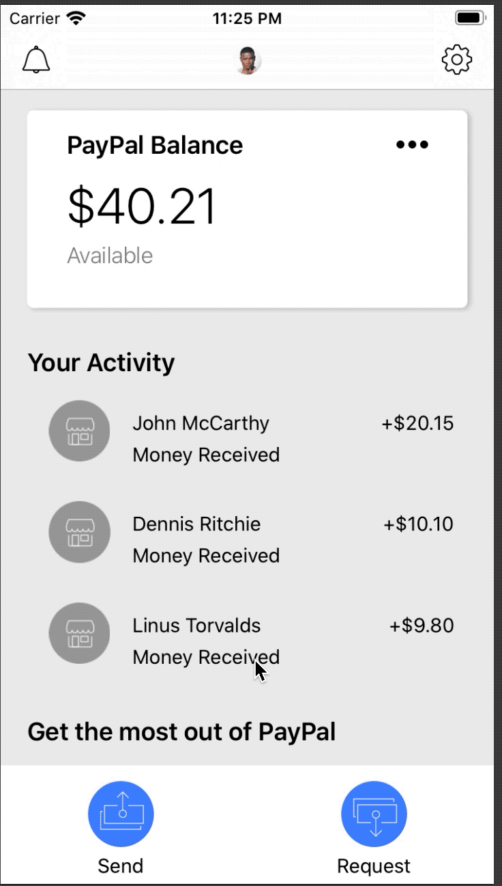

# PayPal Design

This project is from **iOS 12 & Swift 5 - App Design, UI/UX plus Development** course by **Gwinyai Nyatsoka**.

[Course Link](https://www.udemy.com/course/app-design-uiux-plus-ios-development/)

## Topics

- `No Storyboards`. everything done it in programmatic way unlike in course where author prefer storyboard for this design.

- `UIScrollView` in programmatic way.

- `UIStackView` in programmatic way.

## Drawbacks

- Not a clean code.

- Not maintained standards like creating and reusing views, using architecture like MVC, MVVM etc..,

## App Design

